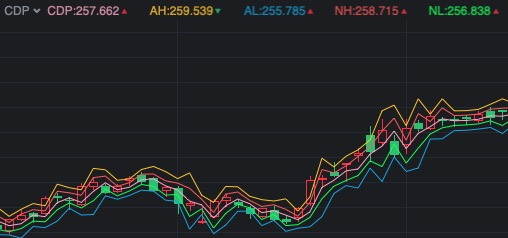

# calculator lib for finance related indicators
# how to use
### basic concept
case 1:
```
resultArr0 = ARR_0 * 2 // would like to multiply each item in ARR_0 by 2, and saves in resultArr0.
```
in js it's actually:
```
resultArr0 = ARR_0.map(item => item * 2)
```
case 2:
```
resultArr1 = ARR_1 - ARR_2 // which means items in ARR_1 minus items in ARR_2 one by one, and returns a new array with the result.
```
with this lib you do thing below to implement the above cases:
```
import FinUtil from './util/FinUtil'

resultArr0 = FinUtil.arrOp(ARR_0, 2, '*') // case1, ARR_0 * 2

resultArr1 = FinUtil.arrOp(ARR_1, ARR_2, '-') // case2, ARR_1 - ARR_2
```


# main story
an original formula you learn from any sources such like some stock softwares or wikipedia, which aims to calculate 123 days/months/minutes of the moving average of the close prices:
```
MA(CLOSE, 123)
```

```
//assume your data arranged as following:
const _DATAS_ = [
    {
        "open": 140.12,
        "high": 141.03,
        "low": 139.5,
        "cLoSe": 139.68,
        "volume": 25446000,
        "date": "2019-08-11"
    },
    {
        "open": 139.69,
        "high": 140.29,
        "low": 139.52,
        "cLoSe": 139.55,
        "volume": 13304300,
        "date": "2019-08-12"
    }
]
```

0. do the import:
```
import FinUtil from './util/FinUtil'
import MA from './src/MA'
```
1. generate array by close-prices:
```
const closePriceArr = FinUtil.genArrByProp(_DATAS_, 'cLoSe')

const ma = MA(closePriceArr, 123) // calculate the ma based on CLOSE and the parameter 123
```
a complex example, let's say MACD:
```
DIF = EMA(CLOSE, SHORT) - EMA(CLOSE, LONG)
DEA = EMA(DIF, MID)
MACD = (DIF - DEA) * 2
```

```
import FinUtil from './util/FinUtil'
import EMA from './EMA'

const close = FinUtil.genArrByProp(_DATAS_, 'cLoSe')

const dif = FinUtil.arrOp(EMA(close, 12), EMA(close, 26), '-') // DIF = EMA(CLOSE, 12) - EMA(CLOSE, 26)

const dea = EMA(dif, 9) // DEA = EMA(DIF, 9)

const macd = FinUtil.arrOp(FinUtil.arrOp(dif, dea, '-'), 2, '*') // MACD = (DIF - DEA) * 2
```
# providing indicators
## ASI
```
```


## BBIBOLL
```
BBIBOLL = (MA(CLOSE, 3) + MA(CLOSE, 6) + MA(CLOSE, 12) + MA(CLOSE, 24)) / 4
UPR = BBIBOLL + M * STD(BBIBOLL, N)
DWN = BBIBOLL - M * STD(BBIBOLL, N)
```


## BIAS
```
MA_V0 = MA(CLOSE, V0)
MA_V1 = MA(CLOSE, V1)
MA_V2 = MA(CLOSE, V2)
BIAS1 = (CLOSE - MA_V0) / MA_V0 * 100
BIAS2 = (CLOSE - MA_V1) / MA_V1 * 100
BIAS3 = (CLOSE - MA_V2) / MA_V2 * 100
```


## BOLL
```
MID  = MA(CLOSE, PERIOD)
UPPER= MID + TIMES * STD(CLOSE, PERIOD)
LOWER= MID - TIMES * STD(CLOSE, PERIOD)
```


## CCI
```
TYP = (HIGH + LOW + CLOSE) / 3
CCI = (TYP - MA(TYP, N)) / (0.015 * AVEDEV(TYP, N))
```


## CDP
```
CH = REF(HIGH, 1)
CL = REF(LOW, 1)
CC = REF(CLOSE, 1)
CDP = (CH + CL + CC) / 3
AH = CDP + CH - CL
AL = CDP - CH + CL
NH = CDP * 2 - CL
NL = CDP * 2 - CH
```



## DMA
```
DIF = MA(CLOSE, SHORT) - MA(CLOSE, LONG)
DMA = MA(DIF, M)
```


## DMI
```
MTR = EXPMEMA(MAX(MAX(HIGH - LOW, ABS(HIGH - REF(CLOSE, 1))), ABS(REF(CLOSE, 1) - LOW)), N)
HD = HIGH - REF(HIGH, 1)
LD = REF(LOW, 1) - LOW
DMP = EXPMEMA(IF(HD > 0 && HD > LD, HD, 0), N)
DMM = EXPMEMA(IF(LD > 0 && LD > HD, LD, 0), N)
PDI = DMP * 100 / MTR
MDI = DMM * 100 / MTR
ADX = EXPMEMA(ABS(MDI - PDI) / (MDI + PDI) * 100, M)
ADXR = EXPMEMA(ADX, M)
```


## EMA
```
```


## EMV
```
VOLUME = MA(VOL, N) / VOL
MID = 100 * (HIGH + LOW - REFV(HIGH + LOW, 1)) / (HIGH + LOW)
EMV = MA(MID * VOLUME * (HIGH - LOW) / MA(HIGH - LOW, N), N)
EMVA = MA(EMV, N1)
```


## KDJ
```
RSV = (CLOSE - LLV(LOW, P1)) / (HHV(HIGH, P1) - LLV(LOW, P1)) * 100
K = SMA(RSV, P2, 1)
D = SMA(K, P3, 1)
J = 3 * K - 2 * D
```


## Moving Average (MA)
```
```


## MACD
```
DIF = EMA(CLOSE, SHORT) - EMA(CLOSE, LONG)
DEA = EMA(DIF, MID)
MACD = (DIF - DEA) * 2
```


## MTM
```
MTM = CLOSE - REF(CLOSE, N)
MTMMA = MA(MTM, M)
```


## OBV
```
```


## ROC
```
ROC = (CLOSE - REF(CLOSE, N)) / REF(CLOSE, N) * 100
ROCMA = MA(ROC, M)
```


## RSI
```
LC = REF(CLOSE, 1)
MAXARR = MAX(CLOSE - LC, 0)
ABSARR = ABS(CLOSE - LC)
RSI1 = SMA(MAXARR, v0, 1) / SMA(ABSARR, v0, 1) * 100
RSI2 = SMA(MAXARR, v1, 1) / SMA(ABSARR, v1, 1) * 100
RSI3 = SMA(MAXARR, v2, 1) / SMA(ABSARR, v2, 1) * 100
```


## SAR
```
```


## TRIX
```
TR = EMA(EMA(EMA(CLOSE, P), P), P)
TR1 = REF(TR, 1)
TRIX = (TR - TR1) / TR1 * 100
TRMA = MA(TRIX, N)
```


## VR
```
ref1 = REF(CLOSE, 1)
TH = SUM(IFF(CLOSE > LC, VOL, 0), N)
TL = SUM(IFF(CLOSE < LC, VOL, 0), N)
TQ = SUM(IFF(CLOSE = LC, VOL, 0), N)
VR = 100 * (TH * 2 + TQ) / (TL * 2 + TQ)
VRMA = MA(VR, M)
```


## WR
```
```


## WVAD
```
WVAD = (CLOSE - OPEN) / (HIGH - LOW) * VOL
```

