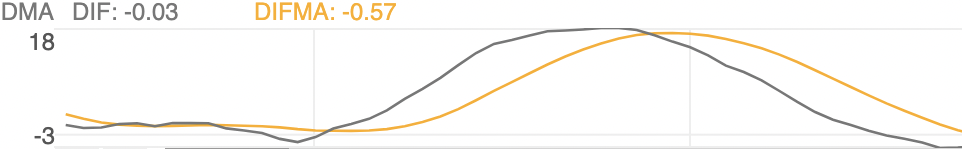
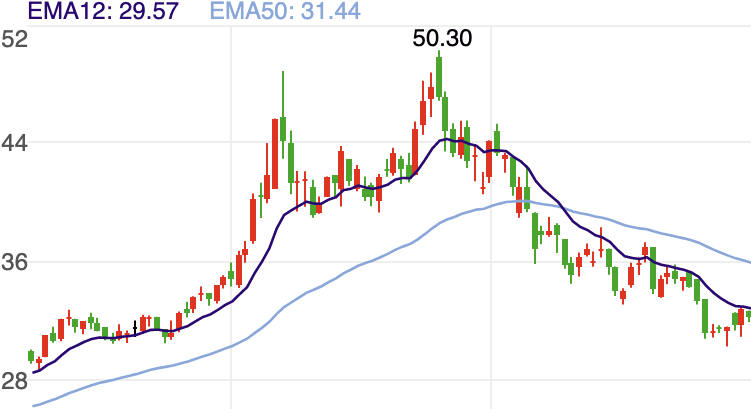

# calculator lib for finance related indicators

## ASI


## BBIBOLL
```
BBIBOLL = (MA(CLOSE, 3) + MA(CLOSE, 6) + MA(CLOSE, 12) + MA(CLOSE, 24)) / 4
UPR = BBIBOLL + M * STD(BBIBOLL, N)
DWN = BBIBOLL - M * STD(BBIBOLL, N)
```


## BIAS
```
MA_V0 = MA(CLOSE, V0)
MA_V1 = MA(CLOSE, V1)
MA_V2 = MA(CLOSE, V2)
BIAS1 = (CLOSE - MA_V0) / MA_V0 * 100
BIAS2 = (CLOSE - MA_V1) / MA_V1 * 100
BIAS3 = (CLOSE - MA_V2) / MA_V2 * 100
```


## BOLL
```
MID  = MA(CLOSE, PERIOD)
UPPER= MID + TIMES * STD(CLOSE, PERIOD)
LOWER= MID - TIMES * STD(CLOSE, PERIOD)
```


## CCI
```
TYP = (HIGH + LOW + CLOSE) / 3
CCI = (TYP - MA(TYP, N)) / (0.015 * AVEDEV(TYP, N))
```


## DMA
```
DIF = MA(CLOSE, SHORT) - MA(CLOSE, LONG)
DMA = MA(DIF, M)
```



## DMI
```
MTR = EXPMEMA(MAX(MAX(HIGH - LOW, ABS(HIGH - REF(CLOSE, 1))), ABS(REF(CLOSE, 1) - LOW)), N)
HD = HIGH - REF(HIGH, 1)
LD = REF(LOW, 1) - LOW
DMP = EXPMEMA(IF(HD > 0 && HD > LD, HD, 0), N)
DMM = EXPMEMA(IF(LD > 0 && LD > HD, LD, 0), N)
PDI = DMP * 100 / MTR
MDI = DMM * 100 / MTR
ADX = EXPMEMA(ABS(MDI - PDI) / (MDI + PDI) * 100, M)
ADXR = EXPMEMA(ADX, M)
```


## EMA



## EMV
```
VOLUME = MA(VOL, N) / VOL
MID = 100 * (HIGH + LOW - REFV(HIGH + LOW, 1)) / (HIGH + LOW)
EMV = MA(MID * VOLUME * (HIGH - LOW) / MA(HIGH - LOW, N), N)
EMVA = MA(EMV, N1)
```


## KDJ

```
RSV = (CLOSE - LLV(LOW, P1)) / (HHV(HIGH, P1) - LLV(LOW, P1)) * 100
K = SMA(RSV, P2, 1)
D = SMA(K, P3, 1)
J = 3 * K - 2 * D
```


## Moving Average (MA)


## MACD
```
DIF = EMA(CLOSE, SHORT) - EMA(CLOSE, LONG)
DEA = EMA(DIF, MID)
MACD = (DIF - DEA) * 2
```


## OBV


## ROC
```
ROC = (CLOSE - REF(CLOSE, N)) / REF(CLOSE, N) * 100
ROCMA = MA(ROC, M)
```


## RSI
```
LC = REF(CLOSE, 1)
MAXARR = MAX(CLOSE - LC, 0)
ABSARR = ABS(CLOSE - LC)
RSI1 = SMA(MAXARR, v0, 1) / SMA(ABSARR, v0, 1) * 100
RSI2 = SMA(MAXARR, v1, 1) / SMA(ABSARR, v1, 1) * 100
RSI3 = SMA(MAXARR, v2, 1) / SMA(ABSARR, v2, 1) * 100
```


## SAR


## TRIX


## VR


## WR


## WVAD